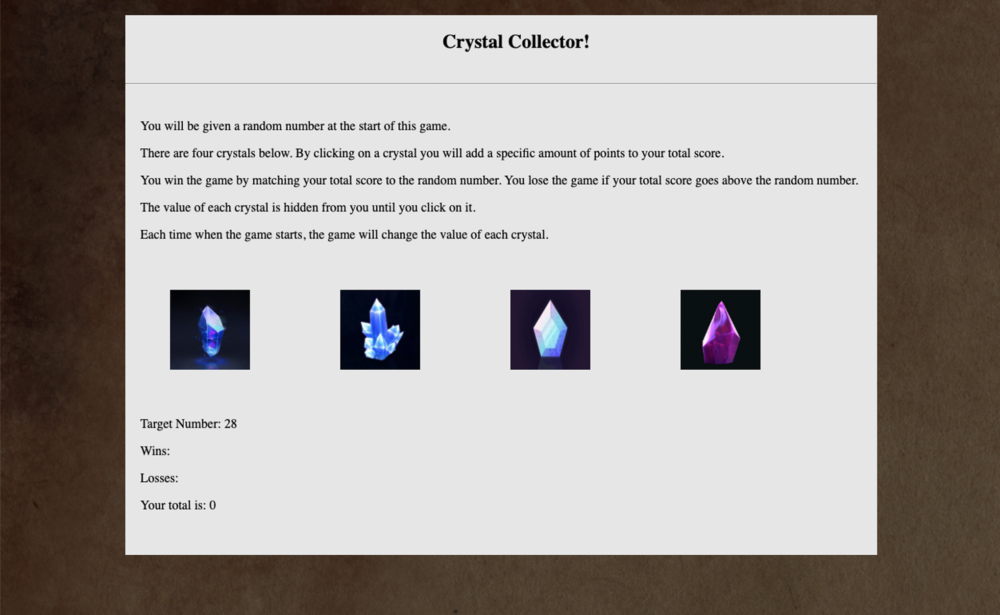

# unit-4-game

<h2> <a href="https://ogilvie1231.github.io/unit-4-game/">Play the Crystal Collector Game</a></h2>
<!--  -->
&nbsp;

When you visit the site a random target number between 20 to 100 is assigned. Each crystal is also assigned a random value between 1 to 12. Your goal is to reach the target number by clicking on the crystals. Be careful not to go over the target number or you will lose. If you lose, your loss count increases by one. If you reach the target number, you win and your win count will increase by one. Your current score is kept track of to help you reach your goal. The assigned values do not change until you win or lose. Good luck!

<ul>
    <li>Built using HTML, CSS and JavaScript</li>
</ul>
